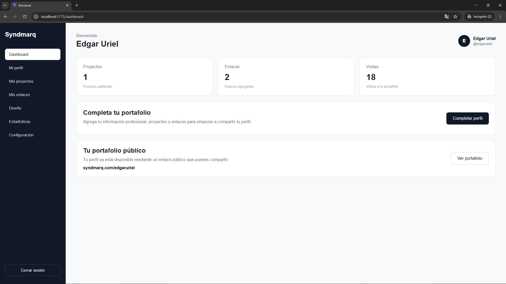
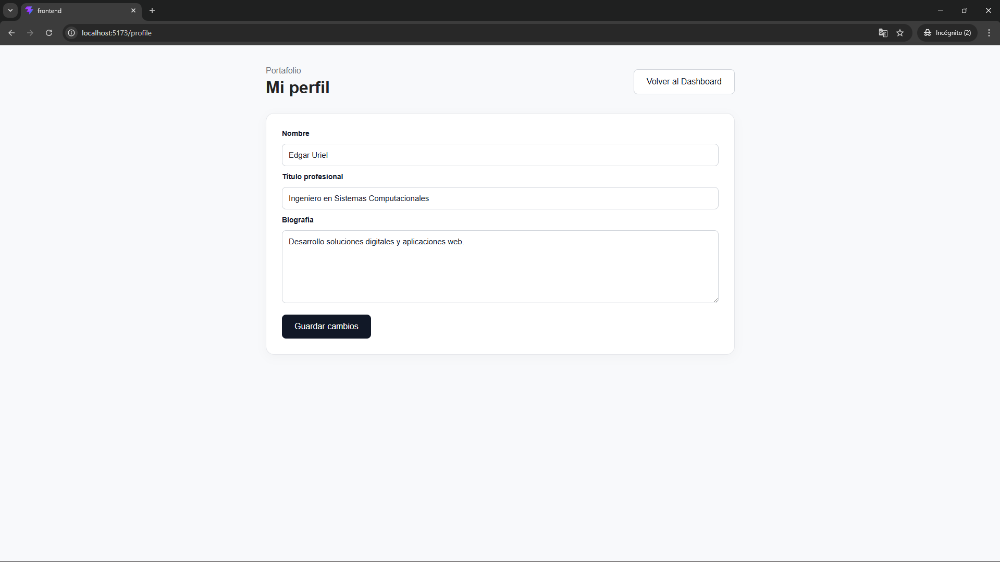
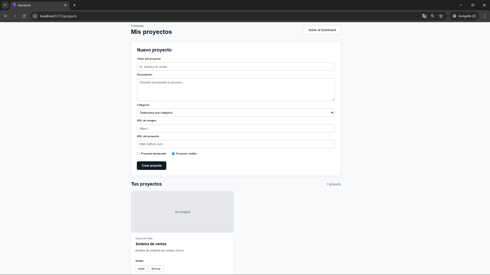
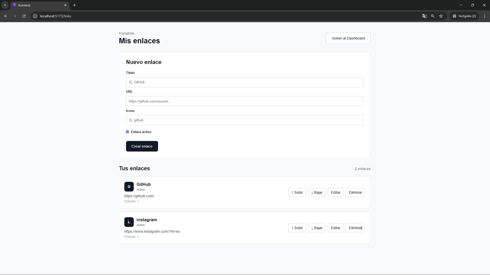
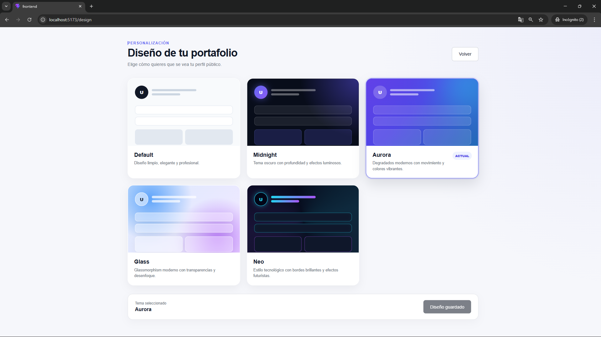
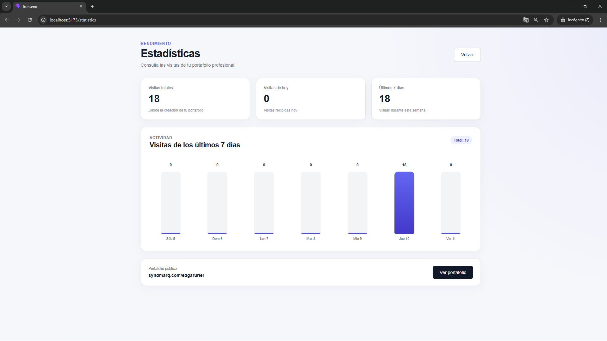
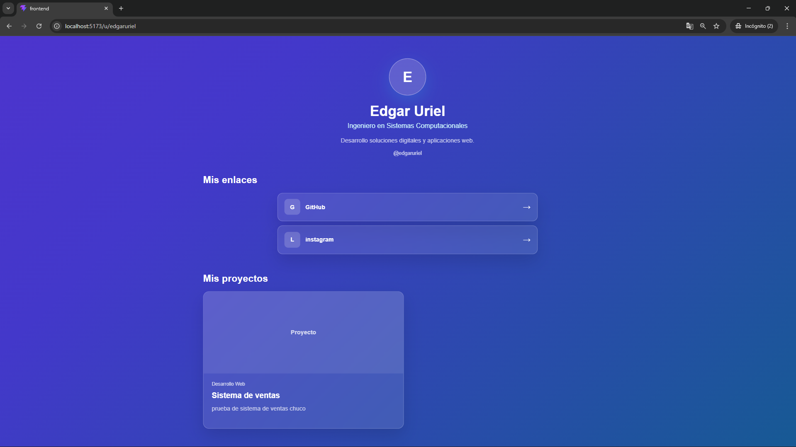

# Plataforma Web de Portafolio Profesional

## Desarrollo de una Plataforma Web para la Centralización y Exhibición de Proyectos Profesionales como Herramienta de Marca Personal

Proyecto desarrollado para **Syndmarq** como parte del proceso de Residencias Profesionales.

La plataforma tiene como objetivo centralizar y exhibir proyectos profesionales en un solo espacio digital, permitiendo a los usuarios crear un perfil profesional, organizar sus proyectos, agregar enlaces y compartir su trabajo mediante un portafolio público.

## Estado del proyecto

**Proyecto en desarrollo**

Actualmente se encuentran implementados los principales módulos de la plataforma y se continúa trabajando en nuevas funcionalidades.

### Funcionalidades implementadas

- Registro de usuarios
- Inicio y cierre de sesión
- Autenticación mediante JWT
- Dashboard de usuario
- Edición del perfil profesional
- Gestión de proyectos
- Creación, edición y eliminación de proyectos
- Gestión de enlaces profesionales
- Ordenamiento de enlaces
- Portafolio público mediante nombre de usuario
- Personalización visual del portafolio
- Diferentes temas de diseño
- Registro de visitas al portafolio
- Estadísticas de visitas
- Gráfica de visitas de los últimos 7 días

### Funcionalidades en desarrollo

- Configuración de cuenta
- Generación y uso de código QR
- Opciones para compartir el portafolio
- Carga y almacenamiento de imágenes
- Panel administrativo
- Mejoras de SEO
- Validaciones y seguridad para producción

---

## Tecnologías utilizadas

### Frontend

- React
- TypeScript
- Vite
- React Router
- CSS

### Backend

- Node.js
- Express
- TypeScript
- JWT
- bcrypt

### Base de datos

- PostgreSQL

### Herramientas de desarrollo

- Visual Studio Code
- Git
- GitHub
- PostgreSQL / psql

---

## Estructura general

```text
Syndmarq/
│
├── backend/
│   ├── src/
│   │   ├── routes/
│   │   ├── db.ts
│   │   └── server.ts
│   ├── package.json
│   └── tsconfig.json
│
├── frontend/
│   ├── src/
│   │   ├── pages/
│   │   ├── assets/
│   │   ├── App.tsx
│   │   └── App.css
│   ├── package.json
│   └── vite.config.ts
│
├── docs/
│   └── screenshots/
│
├── .gitignore
└── README.md
```

---

## Capturas del avance

### Dashboard

Vista principal desde la cual el usuario puede consultar el estado general de su portafolio.



### Perfil profesional

Sección para administrar la información profesional del usuario.



### Gestión de proyectos

Módulo para registrar, editar y administrar los proyectos que serán exhibidos en el portafolio.



### Gestión de enlaces

Sección para administrar los enlaces profesionales del usuario.



### Personalización del diseño

El usuario puede seleccionar diferentes temas visuales para personalizar la presentación de su portafolio.



### Estadísticas

Módulo para consultar las visitas recibidas y la actividad de los últimos siete días.



### Portafolio público

Vista pública en la que se exhibe la información profesional, los proyectos y los enlaces del usuario.



---

## Autor

**Edgar Uriel De La Cruz Casanova**

Ingeniería en Sistemas Computacionales

Proyecto de Residencias Profesionales

---

## Empresa

**Syndmarq**

Proyecto desarrollado para Syndmarq como parte del proceso de Residencias Profesionales.

---

## Nombre del proyecto

**Desarrollo de una Plataforma Web para la Centralización y Exhibición de Proyectos Profesionales como Herramienta de Marca Personal**