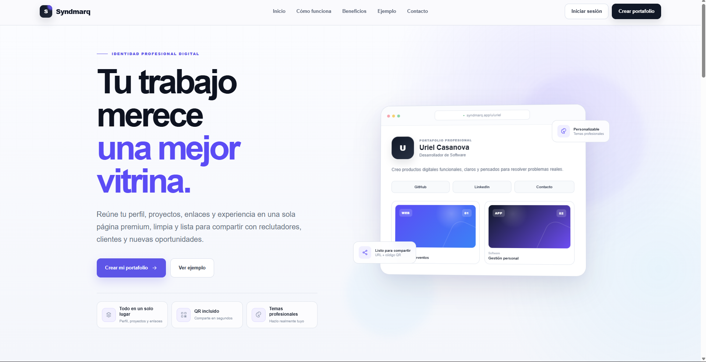
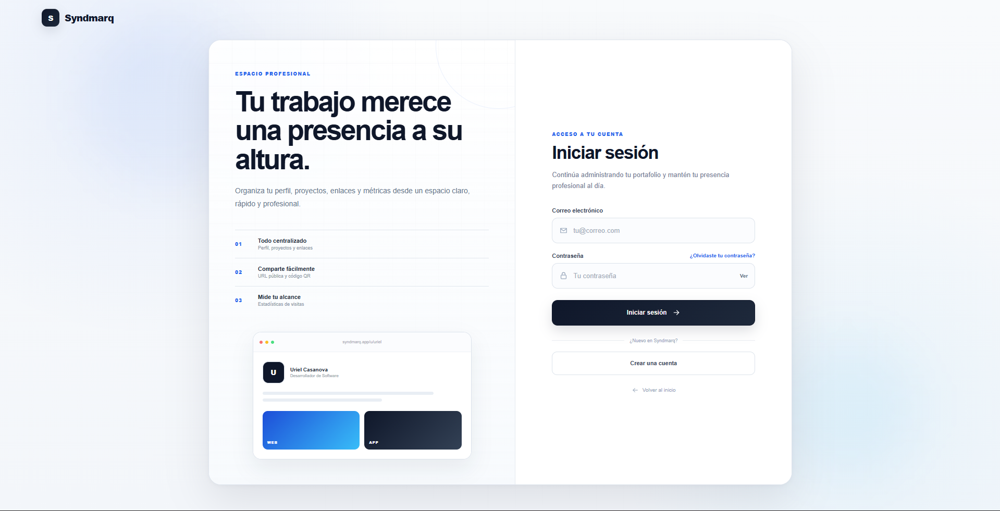
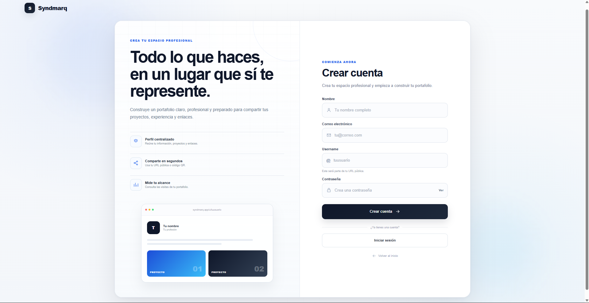

# Plataforma Web de Portafolio Profesional

## Desarrollo de una Plataforma Web para la Centralización y Exhibición de Proyectos Profesionales como Herramienta de Marca Personal

Proyecto desarrollado para **Syndmarq** como parte del proceso de Residencias Profesionales.

La plataforma tiene como objetivo centralizar y exhibir proyectos profesionales en un solo espacio digital, permitiendo a los usuarios crear un perfil profesional, organizar sus proyectos, agregar enlaces y compartir su trabajo mediante un portafolio público.

## Estado del proyecto

**Proyecto en desarrollo**

Actualmente se encuentran implementados los principales módulos de la plataforma y se continúa trabajando en nuevas funcionalidades y mejoras.

### Funcionalidades implementadas

- Página de inicio
- Registro de usuarios
- Inicio y cierre de sesión
- Autenticación mediante JWT
- Dashboard de usuario
- Edición del perfil profesional
- Carga de imagen de perfil
- Gestión de proyectos
- Creación, edición y eliminación de proyectos
- Carga de imágenes para proyectos
- Gestión de enlaces profesionales
- Ordenamiento de enlaces
- Portafolio público mediante nombre de usuario
- Personalización visual del portafolio
- Diferentes temas de diseño
- Registro de visitas al portafolio
- Estadísticas de visitas
- Gráfica de visitas de los últimos 7 días
- Configuración de cuenta
- Cambio de contraseña
- Generación de código QR
- Opciones para compartir el portafolio
- Panel administrativo
- Gestión de usuarios desde el panel administrativo
- Gestión de categorías
- Moderación de proyectos
- Control de visibilidad de portafolios
- Bloqueo de cuentas de usuario
- Implementación básica de metadatos SEO

### Funcionalidades en desarrollo

- Recuperación de contraseña
- Mejoras de SEO
- Mejoras de validación y seguridad
- Optimización del almacenamiento de imágenes
- Mejoras en las herramientas de administración y moderación
- Preparación para despliegue en producción

---

## Tecnologías utilizadas

### Frontend

- React
- TypeScript
- Vite
- React Router
- CSS

### Backend

- Node.js
- Express
- TypeScript
- JWT
- bcrypt

### Base de datos

- PostgreSQL

### Herramientas de desarrollo

- Visual Studio Code
- Git
- GitHub
- PostgreSQL / psql

---

## Capturas del avance

### Página de inicio

Página principal de presentación de la plataforma, desde la cual los usuarios pueden conocer sus principales características y acceder al inicio de sesión o a la creación de una cuenta.

### Inicio de sesión

Interfaz de autenticación que permite a los usuarios registrados acceder a su cuenta y a las herramientas de administración de su portafolio.

### Crear cuenta

Formulario de registro mediante el cual un nuevo usuario puede crear una cuenta proporcionando su información básica y un nombre de usuario para su portafolio.

### Dashboard

Vista principal desde la cual el usuario puede consultar el estado general de su portafolio y acceder a los diferentes módulos de la plataforma.

### Perfil profesional

Sección para administrar la información profesional del usuario, incluyendo sus datos principales e imagen de perfil.

### Gestión de proyectos

Módulo para registrar, editar y administrar los proyectos que serán exhibidos en el portafolio.

### Gestión de enlaces

Sección para administrar y organizar los enlaces profesionales del usuario.

### Personalización del diseño

El usuario puede seleccionar diferentes temas visuales para personalizar la presentación de su portafolio.

### Estadísticas

Módulo para consultar las visitas recibidas por el portafolio y visualizar la actividad de los últimos siete días.

### Portafolio público

Vista pública en la que se exhibe la información profesional, los proyectos y los enlaces del usuario.

---

## Autor

**Edgar Uriel De La Cruz Casanova**

Ingeniería en Sistemas Computacionales

Proyecto de Residencias Profesionales

---

## Empresa

**Syndmarq**

Proyecto desarrollado para Syndmarq como parte del proceso de Residencias Profesionales.

---

## Nombre del proyecto

**Desarrollo de una Plataforma Web para la Centralización y Exhibición de Proyectos Profesionales como Herramienta de Marca Personal**